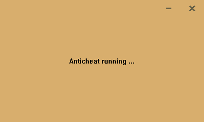

# Saturn Anti Cheat
## Install
### Requirements
- CMake 3.28 (`winget install -e --id Kitware.CMake`).
- Visual Studio Build Tools with the "Desktop development with C++" workload (`winget install -e --id Microsoft.VisualStudio.BuildTools`).
- Windows SDK 10.0.28000 (`winget install -e --id Microsoft.WindowsSDK.10.0.28000`).
- Windows SDK 10.0.26100, for `signtool` (`winget install -e --id Microsoft.WindowsSDK.10.0.26100`).
- Windows driver kit (`winget install Microsoft.WindowsWDK.10.0.28000`).
- just (optional, `winget install -e --id Casey.Just`).

### PC Setup
> [!CAUTION]
> Make sure to save your BitLocker recovery key for your Microsoft account before changing secure boot (`https://account.microsoft.com/devices/recoverykey`).
>
> If you do not have access to the key you may get prompted for it, If it's not provided you will not be able to access any of your encrypted files.
>
> You will not be able to play games that require test signing or secure boot (Fortnite, R6 Siege, Valorant, FaceIT, etc) until you re-enable secure boot and disable testsigning (below), it is also not reccomended due to how the driver can [look like an active kernel cheat](https://www.reddit.com/r/Battlefield/comments/1mlwcbl/battlefield_6_just_told_me_to_uninstall_valorant/).

> [!NOTE]
> While secure boot is disabled you are more vulnerable to malware that can start before the OS.
- Disable `Secure Boot` in your bios.
- Save and reboot.
- Open an admin powershell window and run `bcdedit /set testsigning on`.
- Restart your pc.

### Reverse Setup
- Enable `Secure Boot` in your bios.
- Save and reboot.
- Open an admin powershell window and run:
```bash
# Remove driver traces
sc.exe stop SaturnAC
sc.exe delete SaturnAC
# Disable test mode
# Turning on secure boot can also disable test mode, if this errors, skip it
bcdedit /set testsigning off
```
- Restart your pc.
- Disable `Secure Boot` in your bios.
- Save and reboot.

### Clone the source code
```bash
git clone https://github.com/optccopa/anticheat
cd anticheat
```
> [!NOTE]
> Signing cert is created on first build as `SaturnAC` in `CurrentUser\My`
### Build with `just`:
```bash
just configure && just run
```

### Build with `CMake`:
```bash
cmake -B build -A x64
cmake --build build --config Release
& "./build/bin/Release/SaturnAntiCheatLauncher.exe"
```

## Current Features
### Kernel driver
- Basically nothing besides loading and unloading.
### Launcher
- Starts the game with -insecure.
- Handles the driver; loading and unloading.
- Clean saturn colored native gui.


